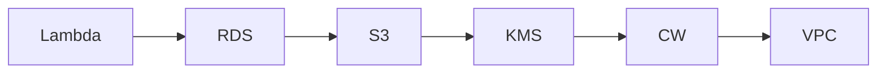

# InfraTales | AWS CDK Security Baseline for Financial Services: 12 Controls, One Stack

**CDK TypeScript reference architecture — security pillar | advanced level**

> A financial institution needs to pass a security audit and their AWS environment has no consistent guardrails — S3 buckets with broad access, unencrypted RDS, no API call logging, and IAM roles that grew organically over three years. The compliance team is breathing down the platform team's neck with a checklist that maps to PCI-DSS and SOC 2 controls. Standing up all of this manually across accounts is error-prone and impossible to reproduce, so they need repeatable IaC that encodes every security control from day one.

[](LICENSE)
[](CONTRIBUTING.md)
[](https://aws.amazon.com/)
[](https://aws.amazon.com/cdk/)
[](https://infratales.com/p/abb8f982-caf9-4a57-adaf-ab41dd767cd1/)
[](https://infratales.com)


## 📋 Table of Contents

- [Overview](#-overview)
- [Architecture](#-architecture)
- [Key Design Decisions](#-key-design-decisions)
- [Getting Started](#-getting-started)
- [Deployment](#-deployment)
- [Docs](#-docs)
- [Full Guide](#-full-guide-on-infratales)
- [License](#-license)

---

## 🎯 Overview

The stack wires together a dense set of security controls using CDK TypeScript: a VPC with Flow Logs enabled, S3 buckets restricted to RFC-1918 CIDR ranges via bucket policies, CloudTrail with a KMS-encrypted S3 trail for account-wide API logging, RDS deployed in private subnets with public accessibility disabled, and Lambda with scoped-down IAM roles. KMS key rotation is enabled with a custom key policy granting least-privilege access to specific AWS service principals — S3, RDS, CloudTrail, and EC2. WAFv2 managed rule groups and CloudWatch metric alarms for unauthorized API calls layer on top, giving the team both preventive and detective controls in a single deployable unit.

**Pillar:** SECURITY — part of the [InfraTales AWS Reference Architecture series](https://infratales.com).
**Target audience:** advanced cloud and DevOps engineers building production AWS infrastructure.

---

## 🏗️ Architecture



> 📐 See [`diagrams/`](diagrams/) for full architecture, sequence, and data flow diagrams.

> Architecture diagrams in [`diagrams/`](diagrams/) show the full service topology (architecture, sequence, and data flow).
> The [`docs/architecture.md`](docs/architecture.md) file covers component responsibilities and data flow.

---

## 🔑 Key Design Decisions

- Shield Advanced costs a flat $3,000/month minimum — for most financial workloads below enterprise scale, Shield Standard plus WAF managed rules gives 80% of the protection at near-zero incremental cost [inferred]
- KMS RemovalPolicy.DESTROY on a financial encryption key means a cdk destroy wipes the key and permanently loses access to any data encrypted with it — this is a data destruction risk in production, not just a cleanup convenience [from-code]
- Hardcoding Environment='production' in bin/tap.ts while also accepting an environmentSuffix context variable creates a tag inconsistency — the resource tag says 'production' even when deploying to dev, breaking any cost allocation or compliance query that filters on the Environment tag [from-code]
- S3 CIDR restriction via bucket policy blocks access from Lambda functions running in public subnets or from services that don't egress through the private CIDR ranges — this silently denies access and is hard to debug without Flow Logs already working [inferred]
- Single-stack design puts all 12+ security constructs in one CloudFormation stack — at scale this will hit the 500-resource limit and deployments will time out or fail partial rollbacks with no clean recovery path [inferred]

> For the full reasoning behind each decision — cost models, alternatives considered, and what breaks at scale — see the **[Full Guide on InfraTales](https://infratales.com/p/abb8f982-caf9-4a57-adaf-ab41dd767cd1/)**.

---

## 🚀 Getting Started

### Prerequisites

```bash
node >= 18
npm >= 9
aws-cdk >= 2.x
AWS CLI configured with appropriate permissions
```

### Install

```bash
git clone https://github.com/InfraTales/<repo-name>.git
cd <repo-name>
npm install
```

### Bootstrap (first time per account/region)

```bash
cdk bootstrap aws://YOUR_ACCOUNT_ID/YOUR_REGION
```

---

## 📦 Deployment

```bash
# Review what will be created
cdk diff --context env=dev

# Deploy to dev
cdk deploy --context env=dev

# Deploy to production (requires broadening approval)
cdk deploy --context env=prod --require-approval broadening
```

> ⚠️ Always run `cdk diff` before deploying to production. Review all IAM and security group changes.

---

## 📂 Docs

| Document | Description |
|---|---|
| [Architecture](docs/architecture.md) | System design, component responsibilities, data flow |
| [Runbook](docs/runbook.md) | Operational runbook for on-call engineers |
| [Cost Model](docs/cost.md) | Cost breakdown by component and environment (₹) |
| [Security](docs/security.md) | Security controls, IAM boundaries, compliance notes |
| [Troubleshooting](docs/troubleshooting.md) | Common issues and fixes |

---

## 📖 Full Guide on InfraTales

This repo contains **sanitized reference code**. The full production guide covers:

- Complete CDK TypeScript stack walkthrough with annotated code
- Step-by-step deployment sequence with validation checkpoints
- Edge cases and failure modes — what breaks in production and why
- Cost breakdown by component and environment
- Alternatives considered and the exact reasons they were ruled out
- Post-deploy validation checklist

**→ [Read the Full Production Guide on InfraTales](https://infratales.com/p/abb8f982-caf9-4a57-adaf-ab41dd767cd1/)**

---

## 🤝 Contributing

See [CONTRIBUTING.md](CONTRIBUTING.md) for guidelines. Issues and PRs welcome.

## 🔒 Security

See [SECURITY.md](SECURITY.md) for our security policy and how to report vulnerabilities responsibly.

## 📄 License

See [LICENSE](LICENSE) for terms. Source code is provided for reference and learning.

---

<p align="center">
  Built by <a href="https://www.rahulladumor.com">Rahul Ladumor</a> | <a href="https://infratales.com">InfraTales</a> — Production AWS Architecture for Engineers Who Build Real Systems
</p>
